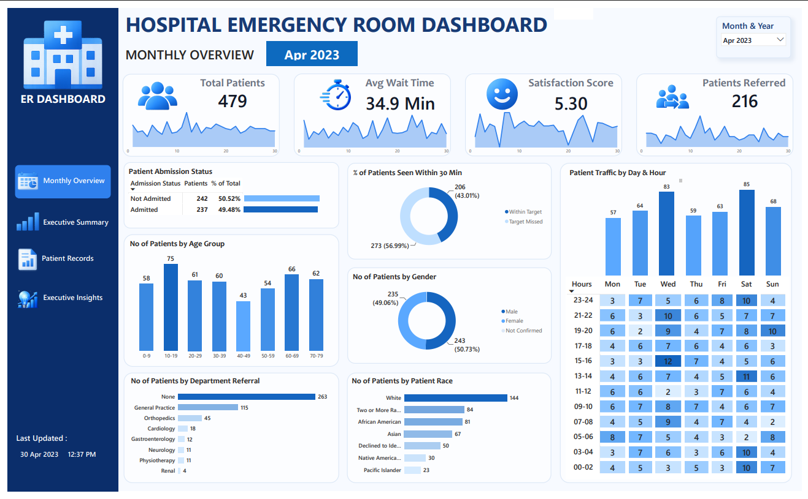
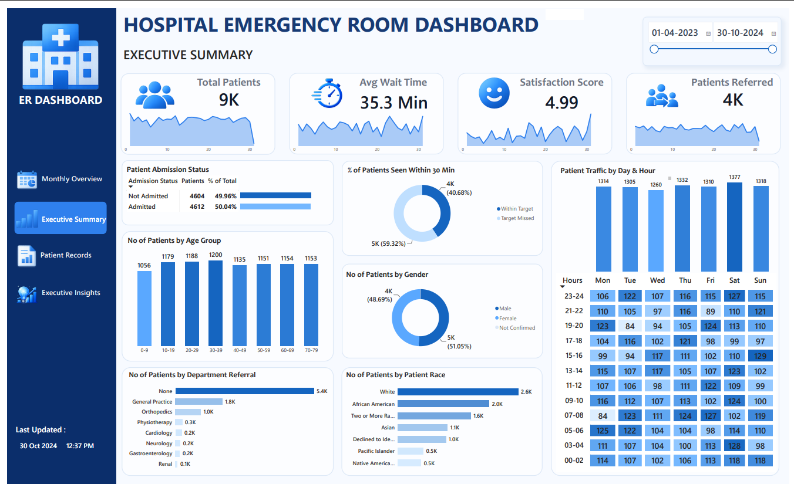
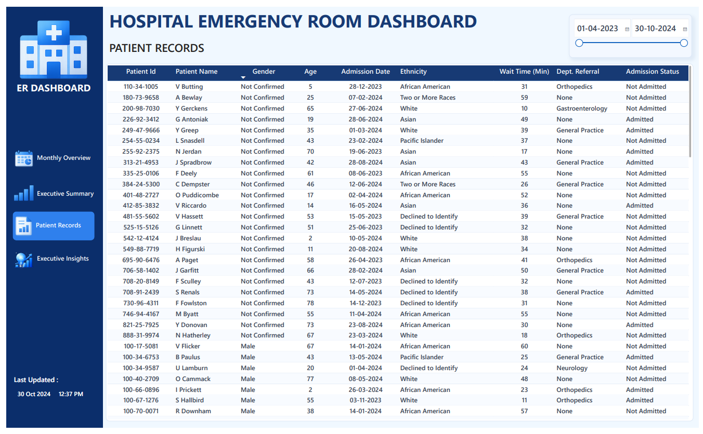
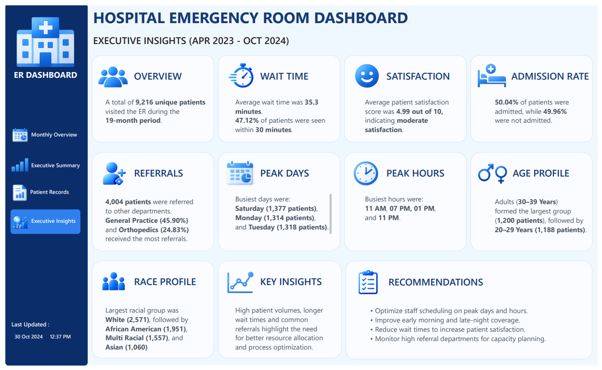

# 🏥 Hospital Emergency Room Dashboard

Interactive Hospital Emergency Room Dashboard built using **Power BI**, **DAX**, **Power Query**, and **Microsoft Excel**.


# 📌 Project Overview

This interactive Power BI dashboard analyzes **9,216 Emergency Room patient records** collected between **April 2023 and October 2024**.

The dashboard provides insights into patient flow, waiting time, referrals, admission rates, patient demographics, and hospital performance through an intuitive multi-page reporting experience.

---

# 🎯 Business Objectives

- Monitor Emergency Room performance
- Track patient waiting time
- Analyze patient satisfaction
- Evaluate admission trends
- Identify peak hours and peak days
- Understand patient demographics
- Analyze department referrals

---

# 📊 Dashboard Pages

## 📅 1. Monthly Overview



### Features

- Monthly KPIs
- Patient Count
- Average Wait Time
- Satisfaction Score
- Admission Status
- Age Distribution
- Gender Distribution
- Race Distribution
- Patient Traffic Heatmap

---

## 📊 2. Executive Summary



### Features

- Overall KPIs
- Department Referral Analysis
- Race Analysis
- Heatmap
- Patient Demographics
- Admission Summary

---

## 👥 3. Patient Records



### Features

- Patient-level records
- Dynamic Date Filter
- Wait Time
- Department Referral
- Admission Status
- Ethnicity Analysis

---

## 💡 4. Executive Insights



### Features

- Executive Overview
- Wait Time Analysis
- Satisfaction Analysis
- Admission Rate
- Peak Days
- Peak Hours
- Age Profile
- Race Profile
- Business Recommendations

---

# 📈 Key Performance Indicators (KPIs)

- 👥 Total Patients
- ⏱ Average Wait Time
- 😊 Patient Satisfaction Score
- 🏥 Patients Referred
- 📊 Admission Rate
- ⏰ Patients Seen Within 30 Minutes

---

# 🛠️ Tools & Technologies

| Tool | Purpose |
|------|---------|
| Power BI | Dashboard Development |
| DAX | KPI Calculations |
| Power Query | Data Cleaning & Transformation |
| Microsoft Excel | Dataset Preparation |

---

# 📂 Repository Structure

```text
hospital-er-dashboard-powerbi
│
├── Dashboard
│   └── Hospital_ER_Dashboard.pbix
│   └── Hospital_ER_Dashboard.pdf
│
├── Dataset
│   └── Hospital_ER_Data.csv
│
├── Images
│   ├── 01_Monthly_Overview.png
│   ├── 02_Executive_Summary.png
│   ├── 03_Patient_Records.png
│   └── 04_Executive_Insights.png
│
└── README.md
```

---

# 💡 Key Insights

- Analyzed over **9,200+ Emergency Room patient records**
- Identified peak patient arrival hours and busiest weekdays
- Monitored average patient waiting time and satisfaction score
- Analyzed referral patterns across hospital departments
- Evaluated patient demographics including age, gender, and race
- Built an executive dashboard to support data-driven hospital decisions

---

# 🚀 Skills Demonstrated

- Data Cleaning
- Data Modeling
- Power Query
- DAX
- Dashboard Design
- Data Visualization
- KPI Development
- Business Intelligence
- Data Storytelling

---

# 👨‍💻 Author

**Aniket Patil**

🎓 Final Year B.E. Computer Engineering

📍 Pune, Maharashtra, India

💼 LinkedIn: https://www.linkedin.com/in/aniket-patil-o07

💻 GitHub: https://github.com/aniket-patil-o07

⭐ If you found this project useful, consider giving it a Star!
